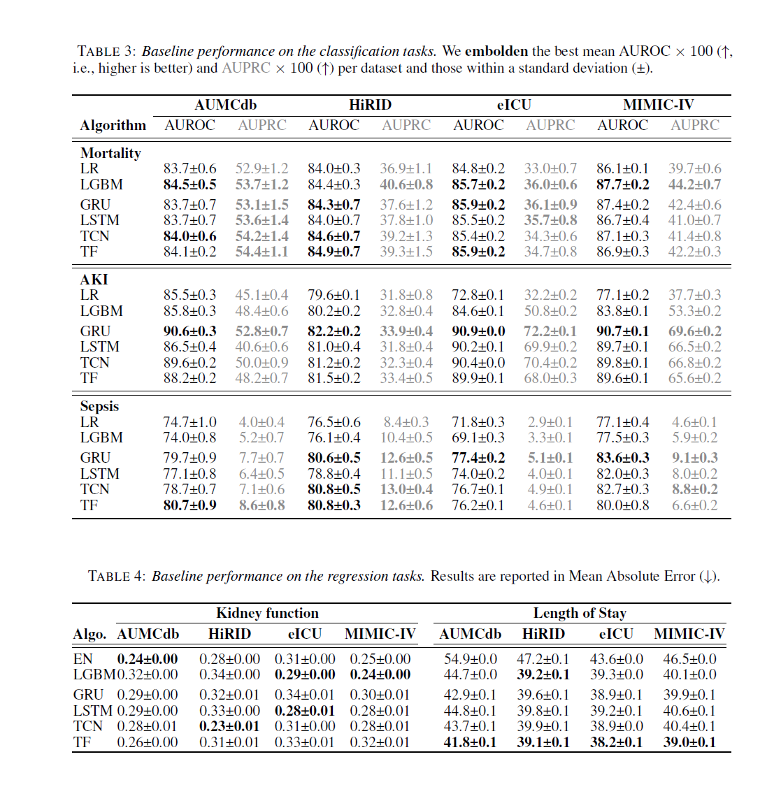

> 📋 This file follows the template for releasing ML research code
> from [papers with code](https://github.com/paperswithcode/releasing-research-code)


# Yet Another ICU Benchmark: _A Flexible Multi-Center Framework for Clinical ML_

This repository is the official implementation of [placeholder](https://arxiv.org/abs/2030.12345).
See a graphical overview of our framework below:

We propose Yet Another ICU Benchmark. It was designed to address the issues of reproduciblity and provide a unified interface to develop
clinical prediction models for the ICU. An experiment in YAIB consists of four steps: 
1) Defining clinical concepts from the raw data.
2) Extracting the patient cohort and specifying the prediction task.
3) Preprocessing and feature generation.
4) Training and evaluation of the ML model.

## 📋 Requirements

YAIB can be installed using conda or pip. Below you will find the three CLI commands to install YAIB using conda.
The

The first command will install an environment based on Python 3.10 (currently).
This should work on x86 hardware.

```
conda env update -f environment.yml
```

We then activate the environment and install a package called `icu-benchmarks`, after which YAIB should be operational.

```
conda activate yaib
pip install -e .
```

To get the datasets for this paper, please see the [YAIB-cohorts repository](https://github.com/rvandewater/YAIB-cohorts) and
the [page on the YAIB wiki](https://github.com/rvandewater/YAIB/wiki/Generating-Cohorts). You
will need to get access to the ICU datasets that you want to run by following a credentialing procedure.

## Training

The easiest method to train the models in the paper is to run these commands from the directory root:

```train
wandb sweep --verbose experiments/benchmark_classification.yml
wandb sweep --verbose experiments/benchmark_regression.yml
```

This will create two hyperparameter sweeps for WandB for the classification and regression tasks.
This configuration will train all the models in the paper. You can then run the following command to train the models:

```train
wandb agent <sweep_id>
```

> Tip: You can choose to run each of the configurations on a SLURM cluster instance by `wandb agent --count 1 <sweep_id>`

### Quickstart

If you do not yet have access to the ICU datasets, you can run the following command to train models for the included demo
(MIMIC-III and eICU) task
cohorts:

```train
wandb sweep --verbose experiments/demo_benchmark_classification.yml
wandb sweep --verbose experiments/demo_benchmark_regression.yml
```

Use the command above to create a sweep and run this sweep.

## Evaluation

Evaluation will happen automatically after running this command. Additionally, YAIB will generate extensive log files and
model files. The logging location is specified within the `.yml` files. We recommend using the `wandb` web-interface to inspect
the results (see your personal WandB project.

## Pre-trained Models

You can download pretrained models here: [YAIB-models GitHub repository](https://github.com/rvandewater/YAIB-models).
YAIB has built-in functionality to evaluate these models. See the below command for an example:

```
icu-benchmarks evaluate \
    -d demo_data/mortality24/eicu_demo \
    -n eicu_demo \
    -t BinaryClassification \
    -tn Mortality24 \
    -m LGBMClassifier \
    --generate_cache \
    --load_cache \
    -s 2222 \
    -l ../yaib_logs \
    -sn mimic \
    --source-dir ../yaib_logs/mimic_demo/Mortality24/LGBMClassifier/2022-12-12T15-24-46/fold_0
```

## 📊Results

The current latest results are shown below. Note that there have been major changes between the classification and regression
task experiments. However, results should be comparable overall. Updated results will be posted in the near future.


## Contributing

This source code is released under the MIT license, included [here](LICENSE). We do not own any of the datasets used or
included in this repository. The demo datasets have been released under
an [Open Data Commons Open Database License (ODbL)](https://opendatacommons.org/licenses/odbl/1-0/).
